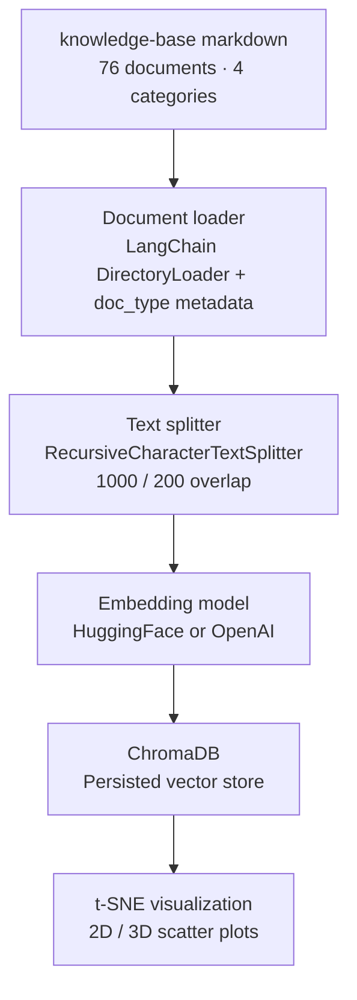
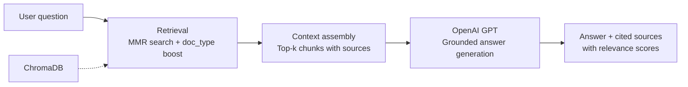
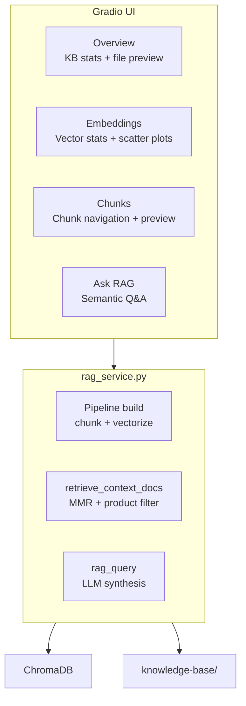

# Insurellm RAG Knowledge Base Explorer

An interactive Retrieval-Augmented Generation (RAG) application that ingests, indexes, and queries a structured knowledge base for a fictional insurance software company. The project demonstrates end-to-end RAG pipeline design—from document loading and chunking through vector storage, embedding visualization, and grounded question answering—in a production-style Gradio interface suitable for live demonstration.

**Repository:** [github.com/bkane56/rag_demo](https://github.com/bkane56/rag_demo)

## What This Project Demonstrates

- Designing a modular RAG pipeline with clear separation between ingestion, retrieval, and generation
- Building an interactive UI for exploring embeddings, chunks, and retrieval quality
- Implementing metadata-aware retrieval (MMR + document-type filtering) to improve answer relevance
- Deploying a Gradio application to Hugging Face Spaces for public portfolio use

## Features

| Capability | Description |
|------------|-------------|
| Knowledge base browser | Preview any of 76 markdown documents across products, contracts, employees, and company information |
| Embedding model selection | HuggingFace `all-MiniLM-L6-v2` (local, default) or OpenAI `text-embedding-3-small` / `text-embedding-3-large` |
| Vector visualization | Interactive 2D and 3D t-SNE scatter plots, color-coded by document type |
| Chunk inspector | Browse individual text chunks with relative source paths and metadata |
| RAG Q&A | Semantic search with source citations and relevance scores, grounded in retrieved context |

## Tech Stack

| Layer | Technology |
|-------|------------|
| UI | Gradio 6 |
| Vector store | ChromaDB |
| Embeddings | HuggingFace `all-MiniLM-L6-v2` (default), OpenAI (optional) |
| Document loading | LangChain Community `DirectoryLoader` |
| Text splitting | LangChain `RecursiveCharacterTextSplitter` (1,000 chars / 200 overlap) |
| LLM | OpenAI GPT-4.1-nano (RAG answers) |
| Visualization | Plotly, scikit-learn (t-SNE) |
| Runtime | Python 3.14+, [uv](https://docs.astral.sh/uv/) |

## Architecture

### Ingestion and indexing pipeline



### RAG query flow



### Application structure



## Getting Started

### Prerequisites

- Python 3.14+
- [uv](https://docs.astral.sh/uv/) package manager

### Setup

```bash
git clone https://github.com/bkane56/rag_demo.git
cd rag_demo
uv sync
cp .env.example .env   # optional — required for OpenAI embeddings and RAG Q&A
```

### Run the Gradio app

```bash
uv run python gradio_app.py
```

Open [http://127.0.0.1:7860](http://127.0.0.1:7860) in your browser.

### Run the CLI pipeline

```bash
uv run python main.py
```

## Environment Variables

| Variable | Required | Purpose |
|----------|----------|---------|
| `OPENAI_API_KEY` | Optional* | OpenAI embedding models and RAG question answering |

\* The default HuggingFace embedding model runs without an API key. OpenAI-powered features remain disabled until the key is configured.

## Deployment

### Hugging Face Spaces

1. Create a new Gradio Space at [huggingface.co/new-space](https://huggingface.co/new-space)
2. Connect or push this repository
3. Add `OPENAI_API_KEY` as a Space secret (Settings → Secrets) to enable RAG Q&A
4. The Space entry point is `app.py`

The application pre-warms the vector store on startup using the local HuggingFace model, so visitors can explore embeddings immediately without waiting for a manual build step.

### Embed on a portfolio site

```html
<iframe
  src="https://bkane56-insurellm-rag-explorer.hf.space"
  width="100%"
  height="900"
  frameborder="0"
  title="Insurellm RAG Knowledge Base Explorer"
></iframe>
```

## Project Structure

```
rag_demo/
├── app.py                  # Hugging Face Spaces entry point
├── gradio_app.py           # Gradio UI and event handlers
├── rag_service.py          # Pipeline, retrieval, and RAG logic
├── main.py                 # CLI entry point
├── knowledge-base/         # Source documents (76 markdown files)
├── document_loader/        # LangChain document loading
├── chunk_and_vectorize/    # Chunking and Chroma persistence
├── explore_knowledge_base/ # Knowledge-base stats and file utilities
└── visualize_vectors/      # Plotly t-SNE scatter plots
```

## License

MIT
